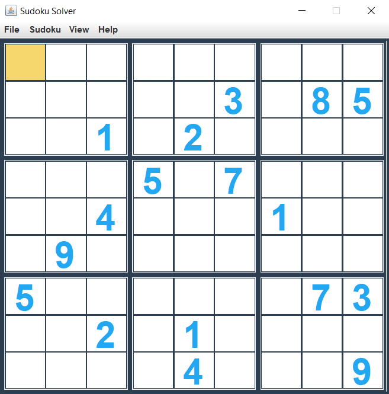
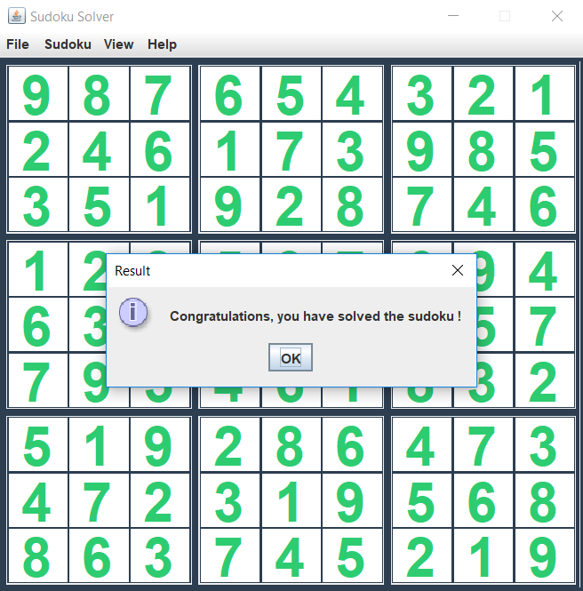

# SudokuSolver
A simple and easy-to-use sudoku solver developed in Java. It uses the [backtracking algorithm](https://en.wikipedia.org/wiki/Sudoku_solving_algorithms#Backtracking). Code is not commented.

## Installation

1. Make sure you have Java JDK installed on your machine
2. Go to the project folder
3. Compile files: `javac main/Main.java`
4. Execute the program: `java main/Main`

## Screenshots

